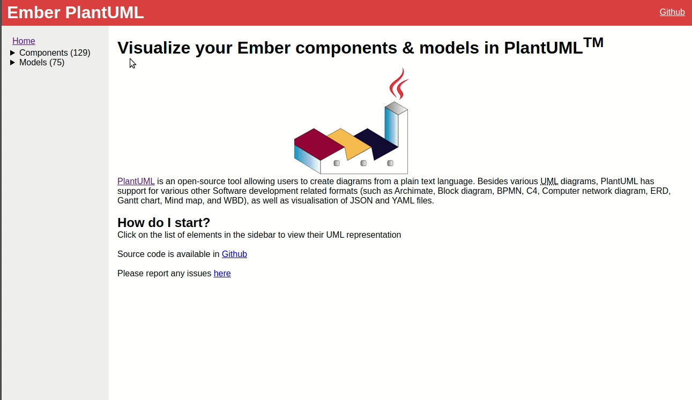

# ember-plantuml


[](https://npmjs.org/package/ember-plantuml "View this project on npm")
[](https://github.com/semantic-release/semantic-release)
[](https://conventionalcommits.org)


A CLI to visualize your Ember.js Components and Models in PlantUML.



## Prerequisites

You will need the following things properly installed on your computer.

* [Java](https://www.oracle.com/in/java/technologies/javase-downloads.html)
* [GraphViz](https://graphviz.org/)

## Usage
```
npx ember-plantuml
```

A new browser window will open where you can explore your project components and models and visualize them using PlantUML.


## Install as a global npm package

```
npm install --global ember-plantuml
```

From your Ember project root folder invoke the CLI:
```
ember-plantuml
```

## Further Reading / Useful Links

* [PlantUML](https://plantuml.com/)
